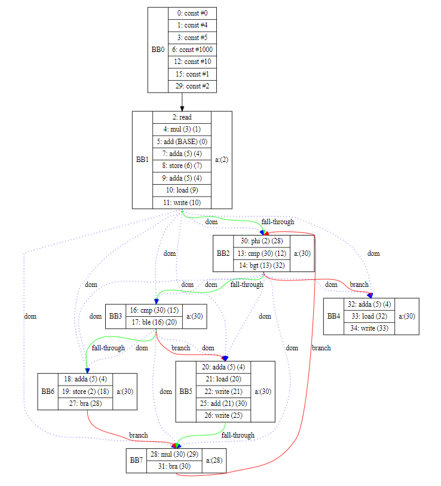

# My Compiler
This project is an optimizing compiler for a simple self-designed programming language called `smpl`.
###### Supported Features:
1. Integer Arithmetics
2. Variables
3. Arrays
4. If Statements
5. While Loops
6. Functions
###### Optimizations:
1. Copy Propagation
2. Common Subexpression Elimination

## Language Syntax
```
letter = “a” | “b” | ... | “z”.
digit = “0” | “1” | ... | “9”.
relOp = “==“ | “!=“ | “<“ | “<=“ | “>“ | “>=“.
ident = letter {letter | digit}.
number = digit {digit}.
designator = ident{ "[" expression "]" }.
factor = designator | number | “(“ expression “)” | funcCall.
term = factor { (“*” | “/”) factor}.
expression = term {(“+” | “-”) term}.
relation = expression relOp expression .
assignment = “let” designator “<-” expression.
funcCall = “call” ident [ “(“ [expression { “,” expression } ] “)” ].
ifStatement = “if” relation “then” statSequence [ “else” statSequence ] “fi”.
whileStatement = “while” relation “do” StatSequence “od”.
returnStatement = “return” [ expression ] .
statement = assignment | funcCall | ifStatement | whileStatement | returnStatement.
statSequence = statement { “;” statement } [ “;” ] .
typeDecl = “var” | “array” “[“ number “]” { “[“ number “]” }.
varDecl = typeDecl indent { “,” ident } “;” .
funcDecl = [ “void” ] “function” ident formalParam “;” funcBody “;” .
formalParam = “(“ [ident { “,” ident }] “)” .
funcBody = { varDecl } “{” [ statSequence ] “}”.
computation = “main” { varDecl } { funcDecl } “{” statSequence “}” “.” .
```
Pre-defined Functions:
```
InputNum() read a number from the standard input
OutputNum(x) write a number to the standard output
OutputNewLine() write a carriage return to the standard output
```
## Example
Input:
```
main
var a;
array[12] d;
{
	let a <- call InputNum();
	let d[5] <- 1000;
	call OutputNum(d[5]);
	while a <= 10 do
		if a > 1 then
			let d[5] <- a;
		else
			call OutputNum(d[5]);
			call OutputNum(d[5] + a);
		fi;
		
		let a <- a * 2;
	od;
	call OutputNum(d[5]);
}.
```
Output:

